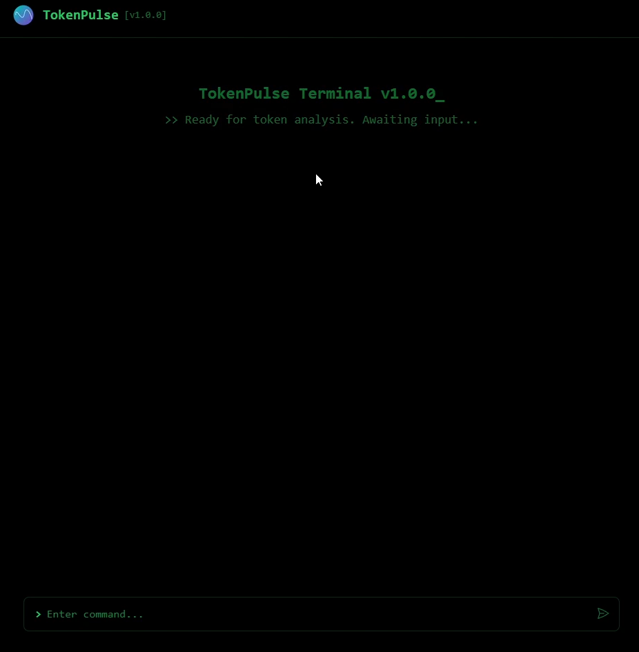
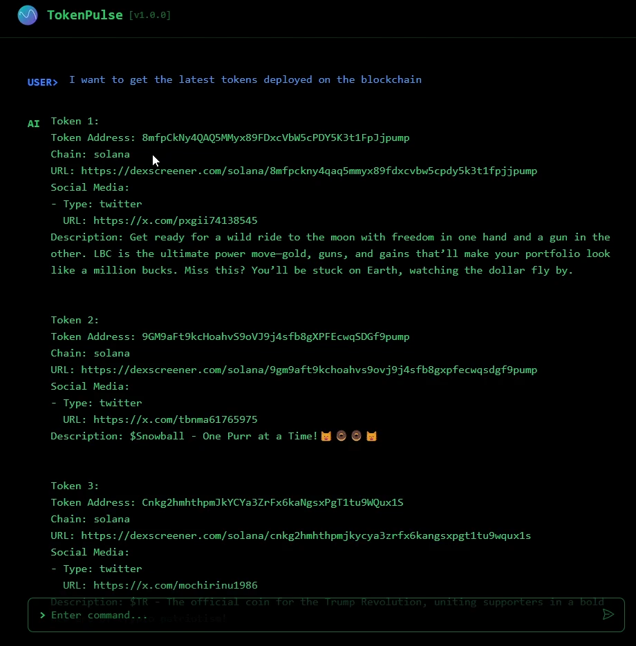
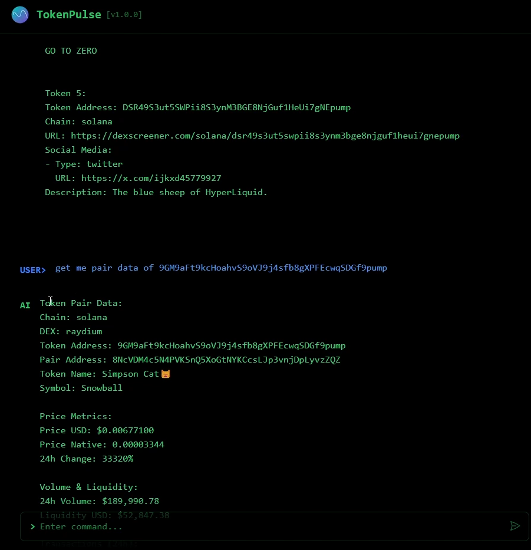
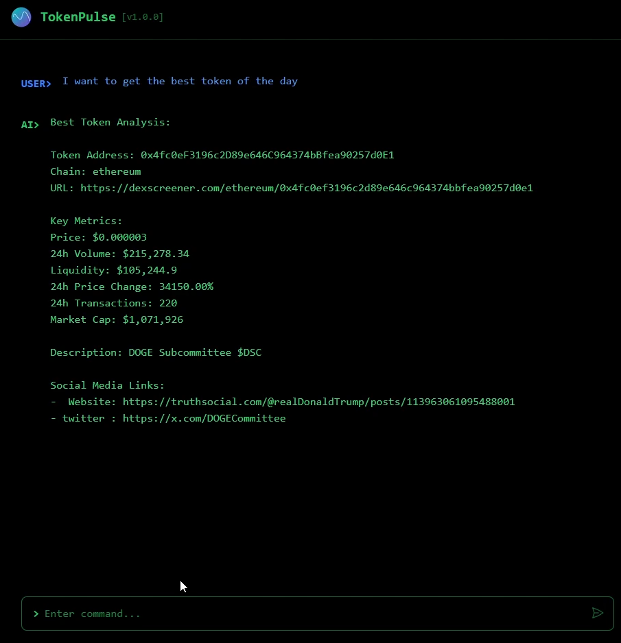
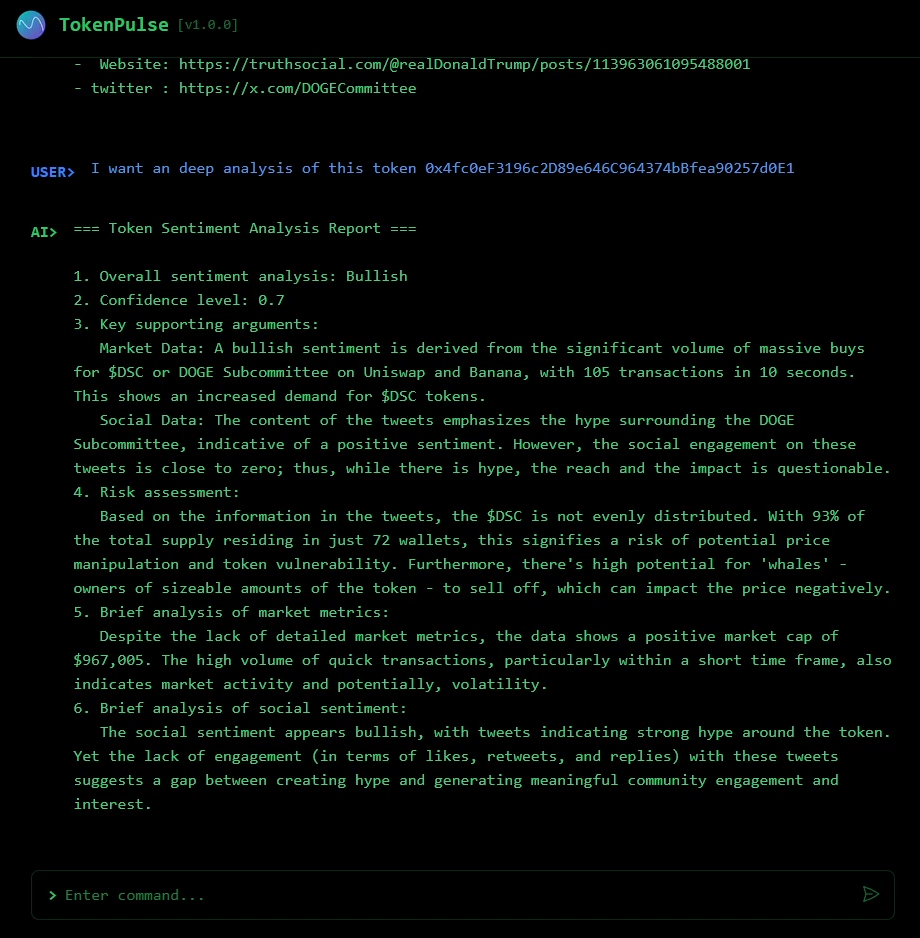

# ETHGlobal Agentic Ethereum Hackathon

https://ethglobal.com/showcase/tokenpulseai-bb3tg

# TokenPulse Chatbot 🤖

<p align="center">
  
</p>

TokenPulse is an AI-powered chatbot specifically designed for cryptocurrency token analysis. It combines real-time market data, social sentiment analysis, and blockchain interactions to provide comprehensive insights about crypto tokens.

## Features 🚀

- **Real-time Token Analysis**

  - Token pair data from DEX platforms
  - Price and liquidity information
  - Trading volume analytics

- **Social Media Insights**

  - Twitter sentiment analysis
  - Social engagement metrics
  - Community trend analysis

- **Blockchain Integration**

  - Direct blockchain interaction via CDP tools
  - Smart contract analysis
  - Wallet interactions

- **Interactive Chat Interface**
  - Real-time streaming responses
  - Natural language processing
  - Context-aware conversations

## Technology Stack 💻

### Frontend

- Next.js 14
- TypeScript
- Tailwind CSS
- Heroicons
- Server-Sent Events (SSE)

### Backend

- Express.js
- LangChain
- Coinbase CDP SDK
- AgentKit Framework

## Requirements

- Node.js 18+
- [OpenAI API Key](https://platform.openai.com/docs/quickstart#create-and-export-an-api-key)
- [Twitter (X) API Keys](https://developer.x.com/en/portal/dashboard)
- [CDP API Key](https://portal.cdp.coinbase.com/access/api)
- [Dexscreener API Access](https://docs.dexscreener.com/api/reference)

### API Setup Instructions

#### Twitter Application Setup

1. Visit the Twitter (X) [Developer Portal](https://developer.x.com/en/portal/dashboard)
2. Navigate to your project and application
3. Edit "User authentication settings"
4. Set "App permissions" to "Read and write and Direct message"
5. Set "Type of App" to "Web App, Automated app or Bot"
6. Configure "App info" urls and save
7. Generate required keys and tokens

### APIs & Services

- Twitter API
- DexScreener
- Pyth Network
- Coinbase CDP

## Getting Started 🏁

### Prerequisites

```bash
node >= 18.0.0
npm >= 9.0.0
```

### Installation

1. Clone the repository:

```bash
git clone https://github.com/yourusername/token-pulse-chatbot.git
cd token-pulse-chatbot
```

2. Install dependencies:

```bash
# Frontend
cd frontend/token-pulse-chatbot
npm install

# Backend
cd ../../backend
npm install
```

3. Set up environment variables:

```bash
# Frontend (.env.local)
NEXT_PUBLIC_API_URL=http://localhost:3001

# Backend (.env)
PORT=3001
OPENAI_API_KEY=your_openai_key
TWITTER_ACCESS_TOKEN=your_twitter_access_token
TWITTER_ACCESS_TOKEN_SECRET=your_twitter_access_token_secret
TWITTER_API_KEY=your_twitter_api_key
TWITTER_API_SECRET=your_twitter_api_secret
CDP_API_KEY_NAME=your_cdp_key_name
CDP_API_KEY_PRIVATE_KEY=your_cdp_private_key
SCHEDULE_ENABLED=true or false
SCHEDULE_INTERVAL_MINUTES=optional
SCHEDULE_TIMEZONE=optional
MAX_DAILY_RUNS=optional
START_HOUR=optional
END_HOUR=optional
# API Configuration
DEXSCREENER_REQUEST_INTERVAL=1000
DEXSCREENER_MAX_RETRIES=3
DEXSCREENER_TIMEOUT=5000
# Token Filtering Thresholds
MIN_LIQUIDITY_USD=50000
MIN_VOLUME_24H=10000
MIN_TXNS_24H=50
MIN_MARKET_CAP=1000000
MAX_MARKET_CAP=100000000
# Scoring Weights (must sum to 1)
WEIGHT_LIQUIDITY=0.25
WEIGHT_VOLUME=0.25
WEIGHT_TRANSACTIONS=0.20
WEIGHT_PRICE_CHANGE=0.15
WEIGHT_MARKET_CAP=0.15
```

4. Start the development servers:

```bash
# Backend
cd ../../backend
npm run server

# Frontend (in a new terminal)
cd frontend/token-pulse-chatbot
npm run dev
```

5. Open [http://localhost:3000](http://localhost:3000) in your browser

## Usage 💡

TokenPulse can help you with:

- Analyzing new token launches
- Monitoring token metrics
- Assessing social sentiment
- Tracking market trends
- Interacting with blockchain contracts

Example queries:

```
"Analyze the latest tokens launched today"
"Get me the best token to buy today"
"What's the social sentiment for $TOKEN?"
"Show me the liquidity metrics for this pair: [address]"
```

## Architecture 🏗️

- **Frontend**: Next.js application with real-time streaming capabilities
- **Backend**: Express server with LangChain integration
- **Agent**: Custom AI agent using AgentKit framework
- **Data Sources**: Multiple providers for comprehensive token analysis

## Screenshots 📸

<p align="center">
  
  <br>
  <em>Main chat interface</em>
</p>

<p align="center">
  
  <br>
  <em>Latest token creations on all chains</em>
</p>

<p align="center">
  
  <br>
  <em>Token liquidity pair data</em>
</p>

<p align="center">
  
  <br>
  <em>The best token from latest token creations</em>
</p>

<p align="center">
  
  <br>
  <em>Social sentiment analysis on a token</em>
</p>

## Contributing 🤝

1. Fork the repository
2. Create your feature branch (`git checkout -b feature/AmazingFeature`)
3. Commit your changes (`git commit -m 'Add some AmazingFeature'`)
4. Push to the branch (`git push origin feature/AmazingFeature`)
5. Open a Pull Request

## License 📝

This project is licensed under the GPL-3.0 License. See the LICENSE file for details.

## Acknowledgments 🙏

- Coinbase CDP Team
- LangChain Community
- DexScreener API
- Twitter API

---

Built with ❤️ by QiteBlock
